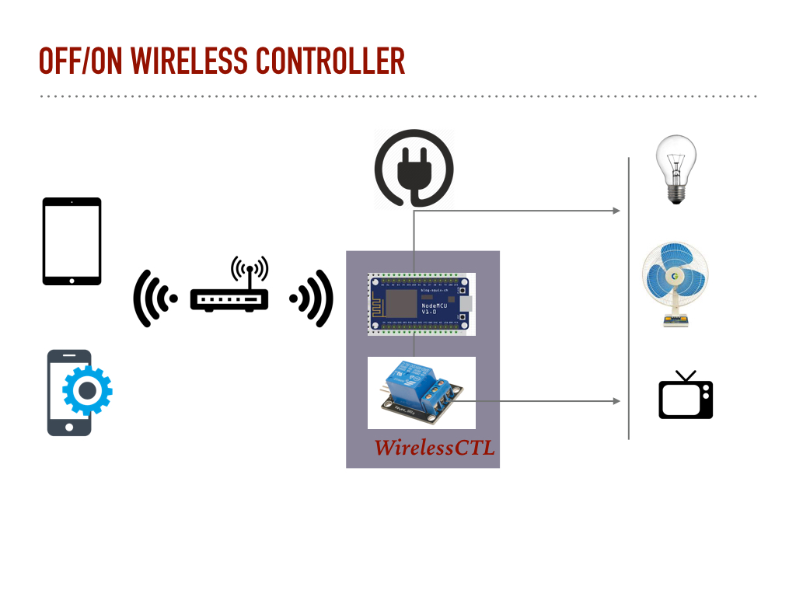

<h1> # WirelessCTL</h1>

NodeMCU based On/Off Generic Wireless Controller.

-FirmWare Folder (NodeMCU binary)  
-Source Folder   (Source Code .ino)  
-Circuit_Diagram  (Circuit Diagram)  
-Mobile Application (Source and binaries for Mobile Application)  

